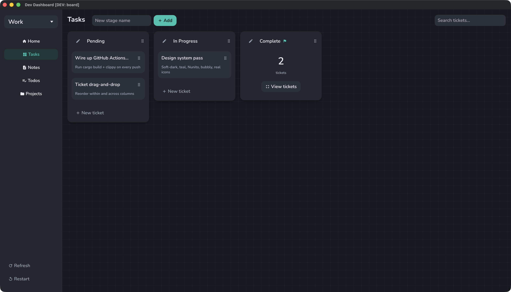

# Dev Dashboard

**A single, self-owned home for your development work.** One native macOS window that pulls your
tasks, quick notes, todos, and local git repositories into one calm, digestible place — so the
state of your work lives somewhere other than your head. It opens on an **Overview** that rolls
the whole workspace up at a glance — what's in progress, what's left to do, and which repos need a
look — so you see where things stand the moment you launch. Your data never leaves your machine.

<p align="center">
  
</p>

> A deliberately **personal, self-use** tool — no accounts, no sync, no cloud. Tuned for one
> developer keeping their own work in order.

## Gallery

Browse the **[full screenshot gallery](static/screenshots/)** for a tour of every screen — the
Overview, Tasks, Notes, Todos, and Projects. Everything else is discoverable in the app itself.

## Disclaimer

The majority of this project was built with AI, this is a self-use project
to assist in daily life. The bar is not incredibly high here and bugs
are acceptable. Use at your own risk.

## Quick start (macOS)

You need **[Docker](https://www.docker.com/products/docker-desktop/)** (installed and running) and
**[Rust](https://rustup.rs)**. Then, from the repo root:

```bash
./dev-dash bootstrap mac
```

That checks Docker, starts the local database, and builds + installs **Dev Dashboard** into
`/Applications`. Launch it from Spotlight or Launchpad and create your first profile.

## The `dev-dash` CLI

Everything — building, the database, launching, screenshots — runs through the `dev-dash` wrapper
in the repo root. Run `./dev-dash help` for the full command list. Optionally symlink it onto your
`PATH` (`ln -sf "$(pwd)/dev-dash" /usr/local/bin/dev-dash`) to call `dev-dash` from anywhere.

---

> **Platform:** built and supported for **macOS only**. It is not tested or supported on Linux or
> Windows, and the tooling (`bootstrap`, the `mac` bundle, screenshots) is macOS-specific.
